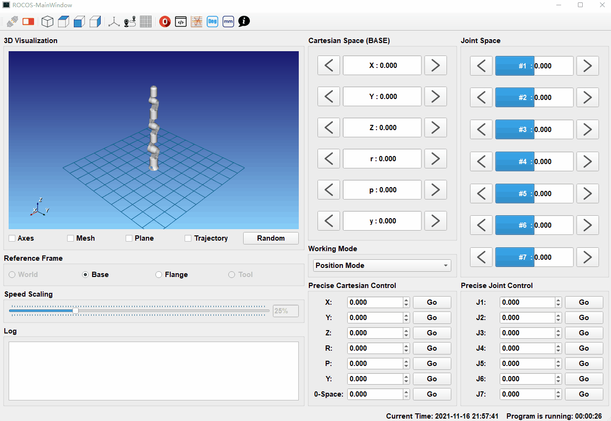

<!--
 Copyright (c) 2021 'Yang Luo, luoyang@sia.cn'

 This software is released under the MIT License.
 https://opensource.org/licenses/MIT
-->

<div align="center">
  
  <h1>ROCOS-Viz</h1>
  <blockquote> The Visualization And Remote Control GUI for ROCOS </blockquote>
</div>




:warning: Rocos-Viz is under development, not finished~ :thinking:

## Introduction

## Dependencies

- [Qt5](https://www.qt.io/cn) Qt GUI libraries

```bash
sudo apt install qt5-default
```

- [Eigen3](http://eigen.tuxfamily.org/index.php?title=Main_Page) Eigen is a C++ template library for linear algebra.

```bash
sudo apt install libeigen3-dev
```

- [VTK](https://vtk.org/) The Visualization Toolkit (VTK) is an open-source, freely available software system for 3D computer graphics, modeling, image processing, volume rendering, scientific visualization, and 2D plotting.

  > VTK8.2 need to be compiled with QVTKOpenglWidget supported.

## Usage

```bash
git clone https://github.com/thinkexist1989/rocos-viz.git
cd rocos-viz/
mkdir build && cd build
cmake ..
make -j`nproc`
./rocos-viz
```

## Contributor

:bust_in_silhouette: **Yang Luo (luoyang@sia.cn)**

:framed_picture: Icon Designed by :**Yuhan Ying (1027649507@qq.com)**

