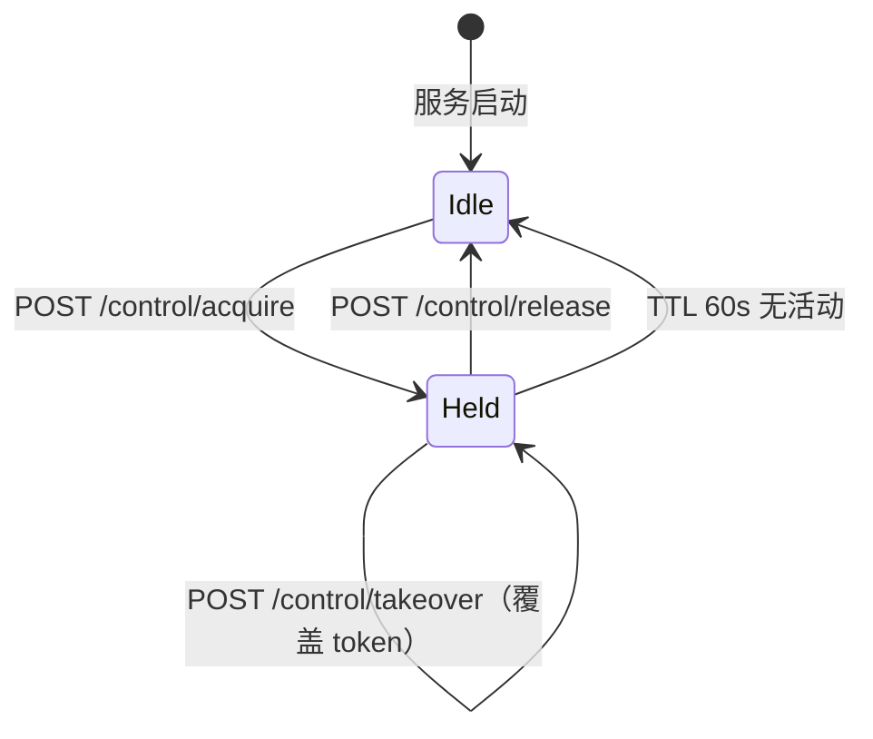
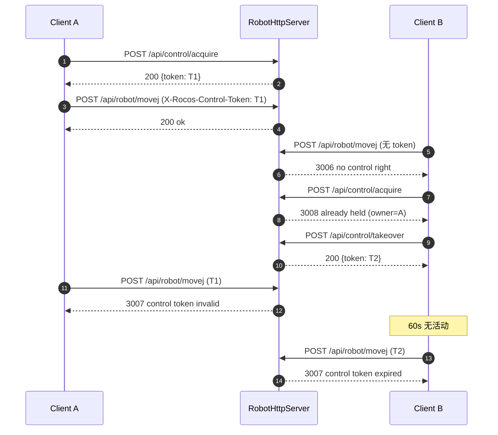

# HTTP API — 控制权（Control Rights）机制

版本：2026-08-11  
关联文件：[`src/robot_http_server.hpp`](../src/robot_http_server.hpp)、[`src/robot_http_server.cpp`](../src/robot_http_server.cpp)

---

## 1. 背景

`RobotHttpServer` 允许多个客户端并发建立 HTTP 连接。若两个客户端同时下发 `MoveJ`、`Enable/Disable`、`SetWorkMode` 等指令，会造成状态机竞态和硬件安全隐患。因此需要在 HTTP 层引入**单持有者控制权（Single-Holder Control Lock）**，保证同一时刻至多一路连接能对机器人下发写指令。

## 2. 设计目标

- **默认第一位申请者得权**：任何客户端都能读取机器人状态；第一个显式调用 `POST /api/control/acquire` 的客户端获得控制权。
- **单持有者互斥**：控制权被占用期间，其他 acquire 请求返回 `3008`。
- **可强制抢占**：任何客户端可通过 `POST /api/control/takeover` 强制夺权，原持有者的 token 立即失效。
- **自动过期**：控制权 TTL 60s；持有者每次调用任何接口（GET/POST/DELETE）自动续期。断线客户端不会长期占权。
- **只读接口无需鉴权**：状态查询/URDF/Mesh/坐标系读取/脚本状态等 GET 接口无需 token。
- **仅在 HTTP 层**：`Robot` 核心类不感知控制权；机制完全内嵌于 `RobotHttpServer`。

## 3. 术语

| 术语 | 说明 |
|---|---|
| **Control Token** | 服务器颁发的 UUID v4 字符串，代表当前唯一控制权。 |
| **Owner** | 当前持有 token 的客户端，通过 `remote_addr` + 可选 `client_name` 标识。 |
| **TTL** | Time-to-Live，默认 60 秒。任何来自 owner 且携带正确 token 的请求会刷新 `last_seen_at_`。 |
| **Takeover** | 无条件抢占，颁发新 token，原 token 立即失效。 |

## 4. 状态机



## 5. Token 传输

- **HTTP 头**：`X-Rocos-Control-Token`
- **值**：UUID v4 字符串，例：`b4f1e7a3-2c9d-4a8f-9e2b-1a5d3c7f0e42`
- **只读接口**：无需带此头。
- **写接口**：必须携带且值匹配当前 owner。缺失/不匹配/过期分别返回 `3006`/`3007`/`3007`。

CORS：`Access-Control-Allow-Headers` 已声明 `X-Rocos-Control-Token`，浏览器端可自由使用。

## 6. 新增 API

### 6.1 `POST /api/control/acquire`

请求体（可选）：
```json
{ "client_name": "web-ui-tablet-01" }
```
- 无持有者 → 颁发 token，返回 `success:true` 与 owner 信息。
- 有持有者且未过期 → 返回 `success:false`, `code:3008`，附现有 owner 信息。

响应示例：
```json
{
  "success": true, "code": 0, "message": "control acquired",
  "data": {
    "token": "b4f1e7a3-2c9d-4a8f-9e2b-1a5d3c7f0e42",
    "has_owner": true,
    "owner_ip": "192.168.1.42",
    "owner_name": "web-ui-tablet-01",
    "owner_agent": "Mozilla/5.0 ...",
    "held_for_seconds": 0,
    "idle_seconds": 0,
    "expires_in_seconds": 60,
    "ttl_seconds": 60
  }
}
```

### 6.2 `POST /api/control/release`

请求头 `X-Rocos-Control-Token: <token>` 必填。
- Token 匹配 → 清空持有者。
- Token 缺失 → `3006`。
- Token 不匹配 → `3007`。

### 6.3 `POST /api/control/takeover`

请求体（可选）：`{ "client_name": "supervisor" }`。**无条件**覆盖当前持有者，颁发新 token；原持有者所有后续写调用将返回 `3007`。日志中记录被抢占的原持有者信息，便于审计。

### 6.4 `GET /api/control/status`（无需 token）

返回当前控制权快照：
```json
{
  "success": true, "code": 0, "message": "ok",
  "data": {
    "has_owner": true,
    "owner_ip": "192.168.1.42",
    "owner_name": "web-ui-tablet-01",
    "owner_agent": "Mozilla/5.0 ...",
    "held_for_seconds": 12,
    "idle_seconds": 3,
    "expires_in_seconds": 57,
    "ttl_seconds": 60
  }
}
```
若 token 已过期，返回前会先做懒清理（`has_owner: false`）。

## 7. 业务错误码

新增至 `3xxx` 机器人状态类：

| 码 | 含义 | 触发场景 |
|---:|---|---|
| `3006` | 无控制权（缺 token） | 未携带 `X-Rocos-Control-Token` 就调用写接口 |
| `3007` | 控制权 token 无效或过期 | Token 不匹配当前 owner，或 60s 未续期 |
| `3008` | 控制权已被他人持有 | Acquire 时已有非过期持有者 |

## 8. 接口权限矩阵

**只读（无需 token）**：
- `GET /api/robot/state` `/info` `/urdf` `/urdf/mesh` `/enabled` `/move_status` `/tool_frames` `/object_frames` `/tool_frame` `/object_frame`
- `GET /api/script/status`
- `GET /api/control/status`
- `GET /api/calibration/result`

**写（必须 token）**：
- `POST /api/robot/enable` `/disable` `/reset` `/workmode`
- `POST /api/robot/servo/*`
- `POST /api/robot/movej` `/movej_ik` `/movel` `/movel_fk` `/movec` `/pause` `/resume` `/stop` `/wait_move`
- `POST /api/robot/jog/*`
- `POST /api/robot/tool_frame` `/object_frame` `/active_tool_frame` `/active_object_frame` `/frames/load` `/frames/save`
- `DELETE /api/robot/tool_frame` `/object_frame`
- `POST /api/calibration/pose` `/tool` `/object` `/run`
- `POST /api/script/upload` `/run` `/pause` `/resume` `/stop` `/step` `/breakpoint/add` `/breakpoint/remove` `/breakpoint/clear`

**控制权自身**：`POST /api/control/acquire`、`POST /api/control/takeover` 无需 token；`POST /api/control/release` 需 token。

## 9. 典型时序



## 10. curl 示例

```bash
# 1. 申请控制权
TOKEN=$(curl -s -X POST http://localhost:8080/api/control/acquire \
  -H 'Content-Type: application/json' \
  -d '{"client_name":"cli"}' | jq -r '.data.token')

# 2. 使用 token 下发运动
curl -s -X POST http://localhost:8080/api/robot/movej \
  -H "X-Rocos-Control-Token: $TOKEN" \
  -H 'Content-Type: application/json' \
  -d '{"joints":[0,0,0,0,0,0]}'

# 3. 查看当前持有者（无需 token）
curl -s http://localhost:8080/api/control/status | jq

# 4. 释放
curl -s -X POST http://localhost:8080/api/control/release \
  -H "X-Rocos-Control-Token: $TOKEN"
```

## 11. 前端集成建议

```ts
// 应用启动或用户点击"接管机器人"按钮时：
const r = await fetch('/api/control/acquire', {
  method: 'POST', headers: {'Content-Type': 'application/json'},
  body: JSON.stringify({ client_name: `web-${navigator.platform}` })
});
const { success, code, data } = await r.json();
if (success) {
  localStorage.setItem('rocos_token', data.token);
} else if (code === 3008) {
  // 提示用户"当前控制权在 XXX，是否强制抢占？"
}

// 所有写调用统一带 header
async function post(url: string, body: unknown) {
  return fetch(url, {
    method: 'POST',
    headers: {
      'Content-Type': 'application/json',
      'X-Rocos-Control-Token': localStorage.getItem('rocos_token') ?? ''
    },
    body: JSON.stringify(body)
  });
}

// 页面卸载时主动释放
window.addEventListener('beforeunload', () => {
  navigator.sendBeacon('/api/control/release', /* headers 需另处理 */);
});
```

## 12. 兼容性与破坏性变更

**升级后所有写接口若不带 `X-Rocos-Control-Token` 都会立即失败**。旧客户端必须调整调用序列：`acquire → 存 token → 每次写调用带 header → 结束时 release`。

不受影响：只读接口（详见 §8）与静态 Web 页面。

## 13. 未包含内容

以下内容**不在**本机制范围内，如有需要另立方案：

- 跨进程持久化：token 仅保存在 `RobotHttpServer` 实例内存中，服务重启即清空。
- 多用户/角色/密码：仅提供单持有者互斥，不做身份认证。
- Token 过期时自动停机：过期只是丢失控制权，不会调用 `StopMotion()`；如需硬件级安全兜底应由物理急停按钮或独立 watchdog 保证。
- UDP servo 数据平面鉴权：仅 servo `start`/`stop` 需 token；UDP 数据本身沿用现有设计。

---

**变更日志**  
- 2026-08-11：初版，新增 `/api/control/{acquire,release,takeover,status}` 四条接口与业务码 `3006/3007/3008`。
