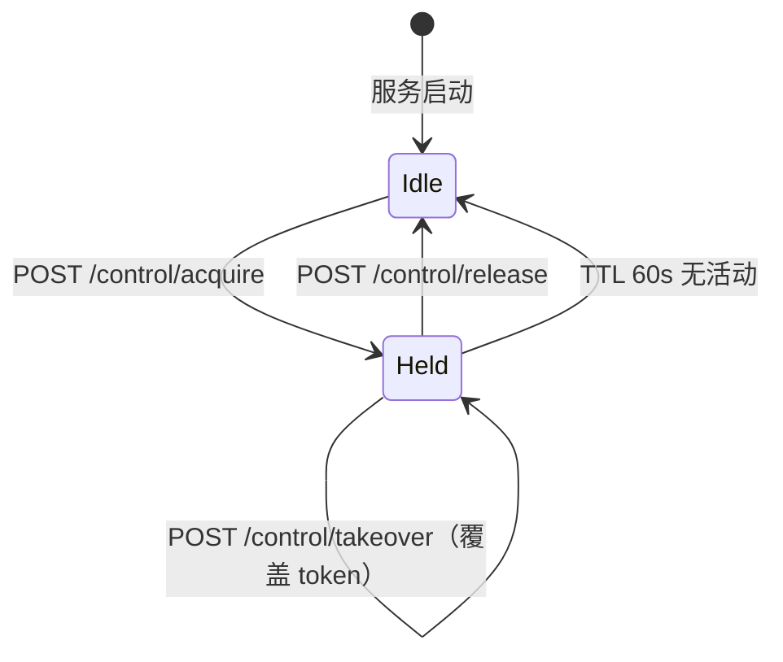
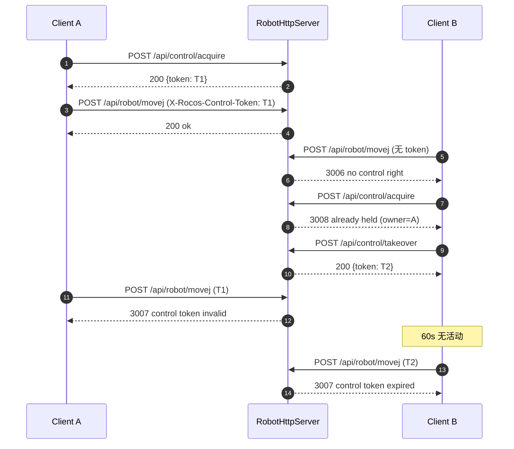

# HTTP API — 控制权（Control Rights）机制

版本：2026-08-12  
关联文件：[`src/robot_http_server.hpp`](../src/robot_http_server.hpp)、[`src/robot_http_server.cpp`](../src/robot_http_server.cpp)

---

## 1. 背景

`RobotHttpServer` 允许多个客户端并发建立 HTTP 连接。若两个客户端同时下发 `MoveJ`、`Enable/Disable`、`SetWorkMode` 等指令，会造成状态机竞态和硬件安全隐患。因此需要在 HTTP 层引入**单持有者控制权（Single-Holder Control Lock）**，保证同一时刻至多一串 token 能对机器人下发写指令。

最小化修改方案是：**控制权获取或强制夺权时，服务端统一生成一串唯一 token 并返回给客户端；后续所有控制指令都必须携带这串 token**。

但 token 本身仅防止不同设备间的并发冲突。同一浏览器多个标签页共享 `localStorage`，因此未获取控制权的标签页可以读取并复用已存储的 token，绕过控制权检查。**为此引入 `X-Rocos-Client-Id` 头机制：每次 `acquire`/`takeover` 将 token 与唯一的 `client_id` 绑定，后续写请求必须同时携带 token 和匹配的 `client_id`**。client_id 由服务端在 acquire 时自动生成（若客户端未主动提供），客户端应在 `sessionStorage`（标签页隔离）中而非 `localStorage`（同源共享）中存储此值。

## 2. 设计目标

- **默认第一位申请者得权**：任何客户端都能读取机器人状态；第一个显式调用 `POST /api/control/acquire` 的客户端获得控制权。
- **按 token 唯一绑定**：控制权绑定到服务端生成的唯一 token；每次 `acquire` 或 `takeover` 都会生成新 token，旧 token 立即失效。
- **单持有者互斥**：控制权被占用期间，其他 acquire 请求返回 `3008`。
- **可强制抢占**：任何客户端可通过 `POST /api/control/takeover` 强制夺权，原持有者的 token 立即失效。
- **自动过期**：控制权 TTL 300s；持有者每次调用任何接口（GET/POST/DELETE）自动续期。断线客户端不会长期占权。
- **token 与 client_id 双重绑定**：服务端始终为每次 `acquire`/`takeover` 绑定一个唯一 `client_id`（客户端可主动提供，否则服务端自动生成）；后续写请求必须同时携带 token 和匹配的 `client_id`，防止同源标签页通过共享 `localStorage` 窃取 token。
- **只读接口无需鉴权**：状态查询/URDF/Mesh/坐标系读取/脚本状态等 GET 接口无需 token。
- **仅在 HTTP 层**：`Robot` 核心类不感知控制权；机制完全内嵌于 `RobotHttpServer`。

## 3. 术语

| 术语 | 说明 |
|---|---|
| **Control Token** | 服务器颁发的 UUID v4 字符串，代表当前唯一控制权。 |
| **Owner** | 当前持有 token 的客户端；服务端每次 `acquire`/`takeover` 都会颁发新的 token，旧 token 立即失效。 |
| **Connection Key** | 可选调试字段，记录 `remote_addr:remote_port`，用于日志审计，不再作为控制权的唯一判定依据。 |
| **TTL** | Time-to-Live，默认 300 秒。任何来自 owner 且携带正确 token 的请求会刷新 `last_seen_at_`。 |
| **Takeover** | 无条件抢占，颁发新 token，原 token 立即失效。 |

## 4. 状态机



## 5. Token 与 Client ID 传输

- **控制权 Token**：`X-Rocos-Control-Token` 头，值为 UUID v4 字符串。
- **Client ID**：`X-Rocos-Client-Id` 头，值为 UUID v4 字符串。**所有写请求必须同时携带此头**，与 `acquire` 时绑定的一致。
  - 服务端在 `acquire`/`takeover` 响应中返回 `client_id`（若客户端未在请求中提供，服务端自动生成并标记 `client_id_auto: true`）。
  - **前端应使用 `sessionStorage` 存储 `client_id`**，而非 `localStorage`——`sessionStorage` 按标签页隔离，可防止未授权标签页窃取。
- **唯一性**：每次 `acquire` 或 `takeover` 生成新 token 和新 client_id 绑定；旧 token 立即失效。
- **只读接口**：无需带任何控制权头。
- **写接口**：必须携带且值匹配当前 owner；缺失/不匹配/过期分别返回 `3006`/`3007`/`3007`。

CORS：`Access-Control-Allow-Headers` 已声明 `X-Rocos-Control-Token, X-Rocos-Client-Id`，浏览器端可自由使用。

## 6. 新增 API

### 6.1 `POST /api/control/acquire`

请求体（可选）：
```json
{
  “client_name”: “web-ui-tablet-01”,
  “client_id”: “ui-session-7f3a8b4d”
}
```
- `client_id` 是前端标签页级唯一 ID，建议在页面载入时生成一次并保存到 **`sessionStorage`**（标签页隔离），而非 `localStorage`（同源共享）。
- 若客户端不提供 `client_id`，服务端将自动生成 UUID 并随响应返回，标记 `client_id_auto: true`。
- 无持有者 → 颁发 token 和 client_id，返回 `success:true` 与 owner 信息。
- 有持有者且未过期 → 返回 `success:false`, `code:3008`，附现有 owner 信息。

响应示例：
```json
{
  “success”: true, “code”: 0, “message”: “control acquired”,
  “data”: {
    “token”: “b4f1e7a3-2c9d-4a8f-9e2b-1a5d3c7f0e42”,
    “client_id”: “ui-session-7f3a8b4d”,
    “client_id_auto”: false,
    “has_owner”: true,
    “owner_ip”: “192.168.1.42”,
    “owner_port”: 52134,
    “owner_connection”: “192.168.1.42:52134”,
    “owner_name”: “web-ui-tablet-01”,
    “owner_agent”: “Mozilla/5.0 ...”,
    “held_for_seconds”: 0,
    “idle_seconds”: 0,
    “expires_in_seconds”: 300,
    “ttl_seconds”: 300
  }
}
```

### 6.2 `POST /api/control/release`

请求头 `X-Rocos-Control-Token: <token>` 必填。
- Token 匹配 → 清空持有者。
- Token 缺失 → `3006`。
- Token 不匹配 → `3007`。

### 6.3 `POST /api/control/takeover`

请求体（可选）：`{ "client_name": "supervisor", "client_id": "..." }`。**无条件**覆盖当前持有者，颁发新 token 和新 client_id；原持有者所有后续写调用将返回 `3007`。日志中记录被抢占的原持有者信息，便于审计。

### 6.4 `GET /api/control/status`（无需 token）

返回当前控制权快照：
```json
{
  "success": true, "code": 0, "message": "ok",
  "data": {
    "has_owner": true,
    "owner_ip": "192.168.1.42",
    "owner_port": 52134,
    "owner_connection": "192.168.1.42:52134",
    "owner_name": "web-ui-tablet-01",
    "owner_agent": "Mozilla/5.0 ...",
    "held_for_seconds": 12,
    "idle_seconds": 3,
    "expires_in_seconds": 297,
    "ttl_seconds": 300
  }
}
```
若 token 已过期，返回前会先做懒清理（`has_owner: false`）。

## 7. 业务错误码

新增至 `3xxx` 机器人状态类：

| 码 | 含义 | 触发场景 |
|---:|---|---|
| `3006` | 无控制权（缺 token） | 未携带 `X-Rocos-Control-Token` 就调用写接口 |
| `3007` | 控制权 token 无效或过期 | Token 不匹配当前 owner，或 300s 未续期，或来自同 IP 但不同连接 `remote_addr:remote_port` |
| `3008` | 控制权已被他人持有 | Acquire 时已有非过期持有者 |

## 8. 接口权限矩阵

**只读（无需 token）**：
- `GET /api/robot/state` `/info` `/urdf` `/urdf/mesh` `/enabled` `/move_status` `/tool_frames` `/object_frames` `/tool_frame` `/object_frame`
- `GET /api/script/status`
- `GET /api/control/status`
- `GET /api/calibration/result`

**写（必须 token）**：
- `POST /api/robot/enable` `/disable` `/reset` `/workmode`
- `POST /api/robot/servo/*`
- `POST /api/robot/movej` `/movej_ik` `/movel` `/movel_fk` `/movec` `/pause` `/resume` `/stop` `/wait_move`
- `POST /api/robot/jog/*`
- `POST /api/robot/tool_frame` `/object_frame` `/active_tool_frame` `/active_object_frame` `/frames/load` `/frames/save`
- `DELETE /api/robot/tool_frame` `/object_frame`
- `POST /api/calibration/pose` `/tool` `/object` `/run`
- `POST /api/script/upload` `/run` `/pause` `/resume` `/stop` `/step` `/breakpoint/add` `/breakpoint/remove` `/breakpoint/clear`

**控制权自身**：`POST /api/control/acquire`、`POST /api/control/takeover` 无需 token；`POST /api/control/release` 需 token。

## 9. 典型时序



## 10. curl 示例

```bash
# 1. 申请控制权
TOKEN=$(curl -s -X POST http://localhost:8080/api/control/acquire \
  -H 'Content-Type: application/json' \
  -d '{"client_name":"cli"}' | jq -r '.data.token')

# 2. 使用 token 下发运动
curl -s -X POST http://localhost:8080/api/robot/movej \
  -H "X-Rocos-Control-Token: $TOKEN" \
  -H 'Content-Type: application/json' \
  -d '{"joints":[0,0,0,0,0,0]}'

# 3. 查看当前持有者（无需 token）
curl -s http://localhost:8080/api/control/status | jq

# 4. 释放
curl -s -X POST http://localhost:8080/api/control/release \
  -H "X-Rocos-Control-Token: $TOKEN"
```

## 11. 前端集成建议

```ts
// 每个标签页生成唯一 client_id，使用 sessionStorage（标签页隔离）
function getOrCreateClientId(): string {
  const key = 'rocos_client_id';
  let id = sessionStorage.getItem(key);
  if (!id) {
    id = crypto.randomUUID?.() ?? `${Date.now()}-${Math.random().toString(36).slice(2)}`;
    sessionStorage.setItem(key, id);
  }
  return id;
}

// 应用启动或用户点击"接管机器人"按钮时：
const clientId = getOrCreateClientId();
const r = await fetch('/api/control/acquire', {
  method: 'POST',
  headers: {
    'Content-Type': 'application/json',
    'X-Rocos-Client-Id': clientId      // 发送 client_id
  },
  body: JSON.stringify({ client_name: `web-${navigator.platform}`, client_id: clientId })
});
const { success, code, data } = await r.json();
if (success) {
  // token 可放入 sessionStorage（标签页隔离，防止被其他标签页窃取）
  sessionStorage.setItem('rocos_token', data.token);
  // 若服务端自动生成了 client_id，使用服务端返回的
  if (data.client_id_auto) {
    sessionStorage.setItem('rocos_client_id', data.client_id);
  }
} else if (code === 3008) {
  // 提示用户"当前控制权在 XXX，是否强制抢占？"
}

// 所有写调用统一带 header
async function post(url: string, body: unknown) {
  return fetch(url, {
    method: 'POST',
    headers: {
      'Content-Type': 'application/json',
      'X-Rocos-Control-Token': sessionStorage.getItem('rocos_token') ?? '',
      'X-Rocos-Client-Id': getOrCreateClientId()   // 每次请求必须携带
    },
    body: JSON.stringify(body)
  });
}

// 页面卸载时主动释放
window.addEventListener('beforeunload', () => {
  navigator.sendBeacon('/api/control/release', /* headers 需另处理 */);
});
```

## 12. 兼容性与破坏性变更

**升级后所有写接口必须同时携带 `X-Rocos-Control-Token` 和 `X-Rocos-Client-Id`**，两者缺一不可。旧客户端必须调整调用序列：`acquire → 存 token + client_id → 每次写调用带两个 header → 结束时 release`。

`client_id` 由服务端在 `acquire` 响应中返回（若客户端未提供则自动生成）。**前端应使用 `sessionStorage` 存储 `client_id`**（标签页隔离），而非 `localStorage`（同源共享）。

不受影响：只读接口（详见 §8）与静态 Web 页面。

## 13. 未包含内容

以下内容**不在**本机制范围内，如有需要另立方案：

- 跨进程持久化：token 仅保存在 `RobotHttpServer` 实例内存中，服务重启即清空。
- 多用户/角色/密码：仅提供单持有者互斥，不做身份认证。
- Token 过期时自动停机：过期只是丢失控制权，不会调用 `StopMotion()`；如需硬件级安全兜底应由物理急停按钮或独立 watchdog 保证。
- UDP servo 数据平面鉴权：仅 servo `start`/`stop` 需 token；UDP 数据本身沿用现有设计。

---
**变更日志**  
- 2026-08-12：引入 `X-Rocos-Client-Id` 头校验，token 与 client_id 双重绑定，防止同源标签页通过共享 `localStorage` 窃取 token 绕过控制权检查。`checkAndRenewToken` 增加 client_id 匹配验证；`acquire`/`takeover` 自动生成 client_id 并在响应中返回。
- 2026-08-11：初版，新增 `/api/control/{acquire,release,takeover,status}` 四条接口与业务码 `3006/3007/3008`。
